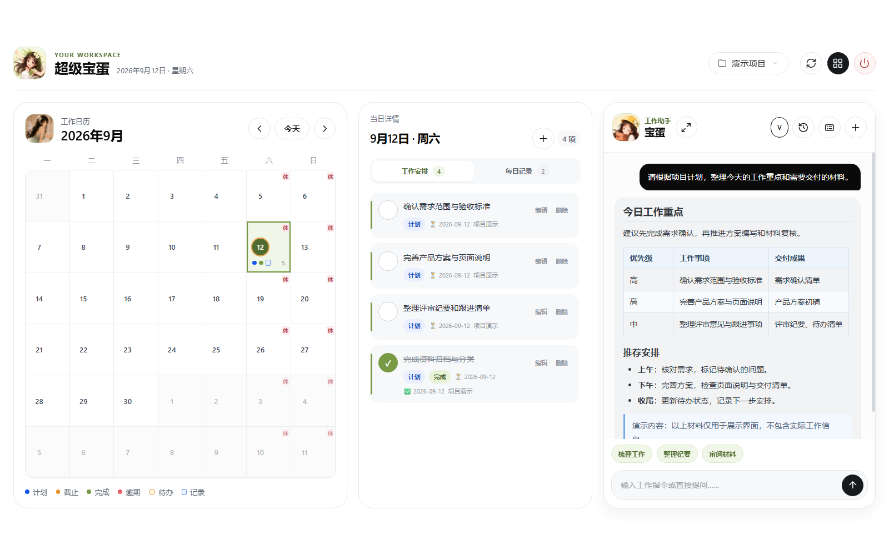
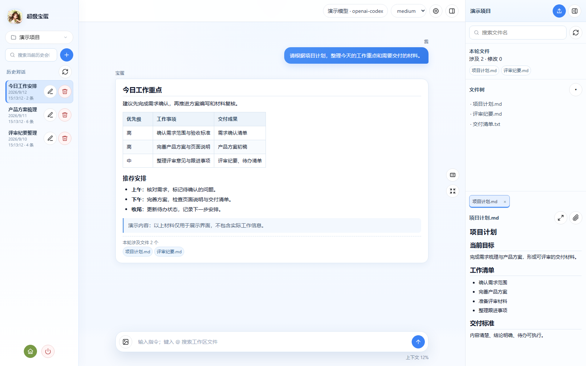
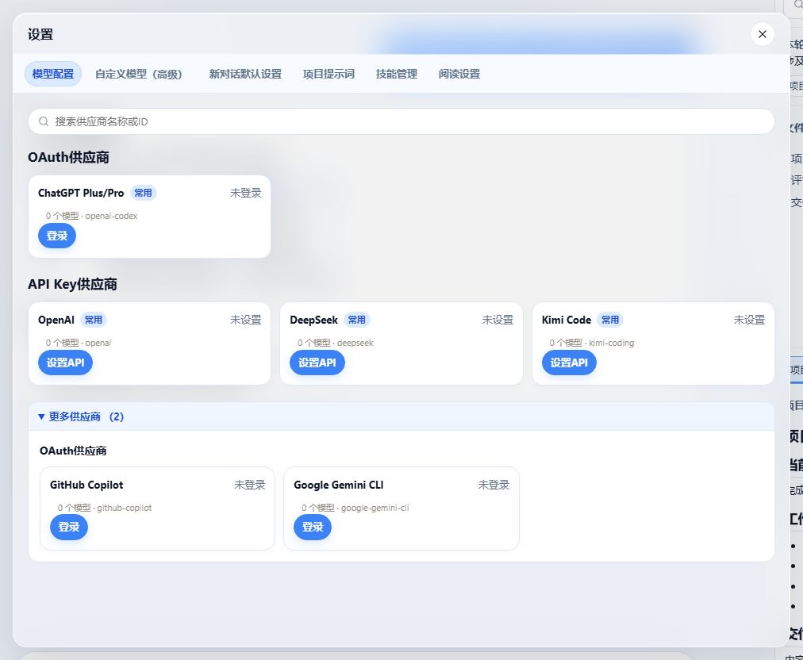
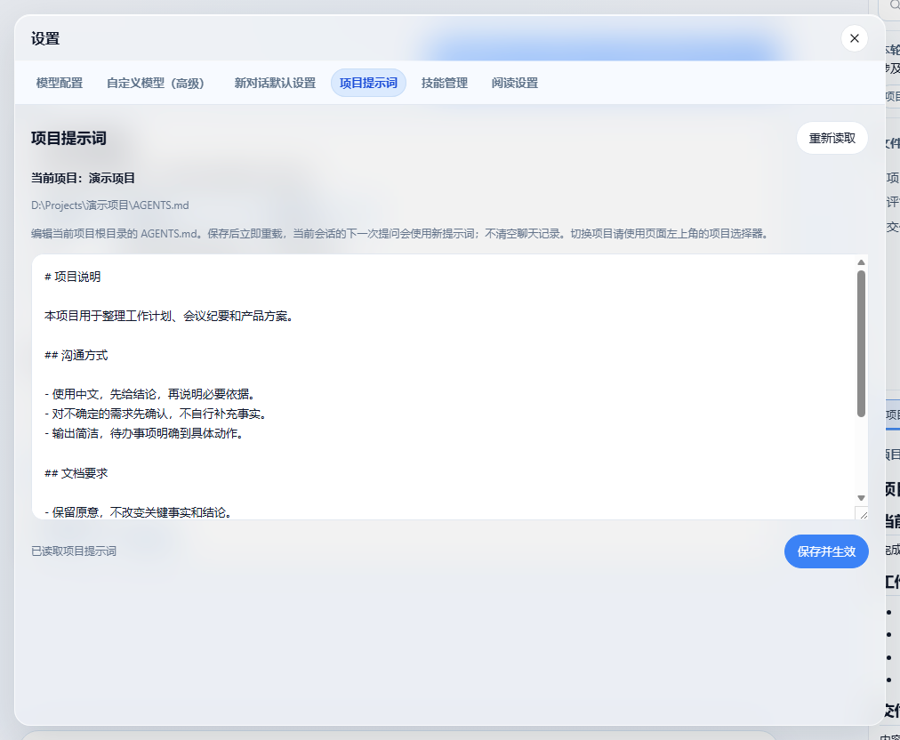
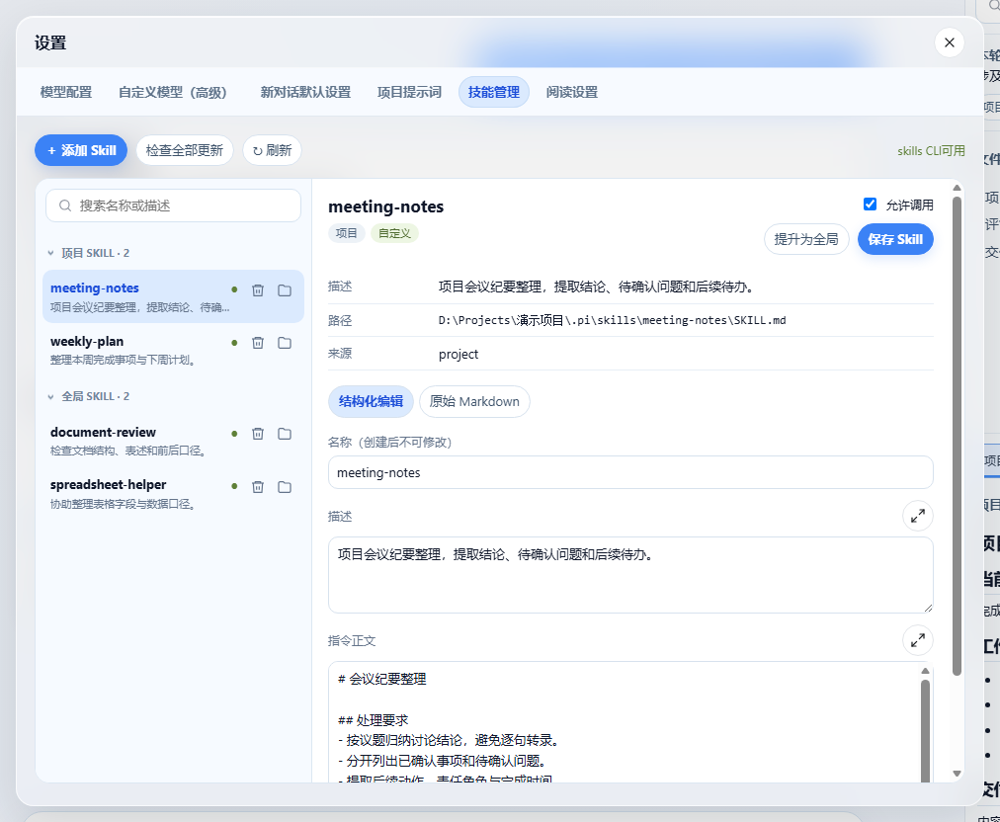

<h1 align="center"> 超级宝蛋</h1>

基于Pi Agent开发的面向个人工作的 Windows 工作台，集中管理日历、待办、每日记录、常用软件和智能助手。

<a href="https://github.com/xmmCQ/SuperBaodan/releases/latest">下载 Windows 安装包</a>

## 安装与使用

### 安装

支持 Windows 10 1809 或更新版本的 64 位系统，首次安装需要联网。

1. 下载并运行 **`SuperBaodan.exe`**。
2. 选择安装目录，等待运行组件自动下载和安装。
3. 从开始菜单或桌面快捷方式打开“超级宝蛋”。

默认安装目录为 `%LOCALAPPDATA%\Programs\SuperBaodan`，启动后在默认浏览器中使用，地址为 `http://127.0.0.1:3212`。

### 首次配置

- **模型账号**：在助手设置中登录支持的账号，或填写供应商 API Key，选择模型和思考等级。模型使用可能需要订阅或接口额度。
- **工作区**：添加需要助手处理的本机目录。
- **工作软件**：在首页“打开工作软件 → 管理软件”中添加程序或快捷方式。
- **Skill 与固定提示词**：按需安装 Skill，配置常用任务。

安装包不包含制作人的账号、个人文件、待办或历史会话。工作软件和固定提示词列表默认为空。

### 更新与卸载

更新前请备份个人数据，并在页面中点击“退出工作台”，再运行新版本安装包。升级默认沿用已登记的安装目录，保留个人数据。

个人数据位于 `%LOCALAPPDATA%\SuperBaodan`：

| 目录 | 内容 |
|---|---|
| `data` | 待办、每日记录、会话、软件配置、固定提示词及备份 |
| `workspace` | 默认工作区文件 |
| `pi\agent` | 模型配置、登录信息及 Skill |
| `installer` | 安装日志 |

卸载默认保留这些数据。勾选“同时删除本软件的个人数据和登录信息”并再次确认后，会一并删除，包括默认工作区文件。**删除不可恢复，请先备份。** 外部工作文件夹和原有 Pi 配置不受影响，浏览器中的页面偏好需另行清除。

助手默认空闲 10 分钟后休眠，再次使用时恢复会话。

## 产品功能

### 日历与待办

- 查看工作日历、当日安排、遗留工作和持续工作。
- 新增、编辑、完成和删除待办，支持多行内容、计划日期、截止日期及周期事项。
- 拖动待办改期，调整当日卡片顺序。
- 显示中国大陆节假日与调休标识。数据来自第三方整理，仅供日程参考，不代表单位排班。
- 日历与每日内容独立加载，读取失败时可直接重试。

### 每日记录

- 按日期保存会议纪要和工作记录，支持 Markdown。
- 通过日历和历史搜索查找记录，调整显示顺序。
- 将选中的记录交给宝蛋整理。
- 写入前备份，遇到同时修改时提示版本冲突。

### 智能助手

- 首页直接对话，展开助手查看完整聊天、思考和执行过程；两处共用模型及账号设置。
- 展开助手支持流式回答，支持 Markdown、表格、代码块和图片输入。
- 图片支持 PNG、JPEG、WebP、GIF，最多 4 张，单张不超过 5 MiB、合计不超过 10 MiB；超限提前提示，明确发送失败后恢复附件。
- 新建、切换、重命名和删除会话，搜索历史标题及对话正文。
- 复制回复和代码块，引用选中文字追问。
- 通过对话目录定位提问和回复标题，快速回到最新消息。
- 停止任务、压缩上下文，在当前任务结束后处理追加消息；连接中断后自动尝试恢复显示。

### 工作区与文件

- 管理多个本机工作区，分别保存对话历史并恢复最后会话。
- 浏览文件树、搜索文件名、上传文件，选择同名文件覆盖或跳过。
- 预览文本、Markdown、代码、图片和 PDF，通过标签切换已打开文件。
- 调整会话栏和文件面板宽度，放大预览、折叠文件树。
- 输入 `@文件名` 引用工作区文件，查看本轮涉及及已确认修改的文件。

### 工作软件

- 在界面中管理最多 20 个本机程序或快捷方式。
- 选择参与一键打开的软件，调整启动顺序，也可单独启动。
- 能识别已运行的软件时跳过重复启动，单个软件失败不影响其他程序。

### 模型、提示词与 Skill

- 按供应商搜索和选择模型，管理默认模型、思考等级及可见范围。
- 支持 ChatGPT Plus/Pro（Codex）等 OAuth 登录、供应商 API Key 和自定义模型配置。

- 在设置中编辑当前项目的提示词，保存后用于当前会话的下一次提问，并提供备份、冲突及未保存提醒。

- 按项目、全局和只读来源查看 Skill，折叠分组并记住状态。
- 搜索、安装、更新、卸载 Skill，管理自动调用显隐，创建和编辑本地自定义 Skill。
- 将本地自定义 Skill 在项目与全局之间迁移，保留备份，同名不覆盖。
- 使用固定提示词、Prompt Templates 和扩展快捷命令。
- 调整聊天字号和正文宽度，保存本机阅读偏好。

